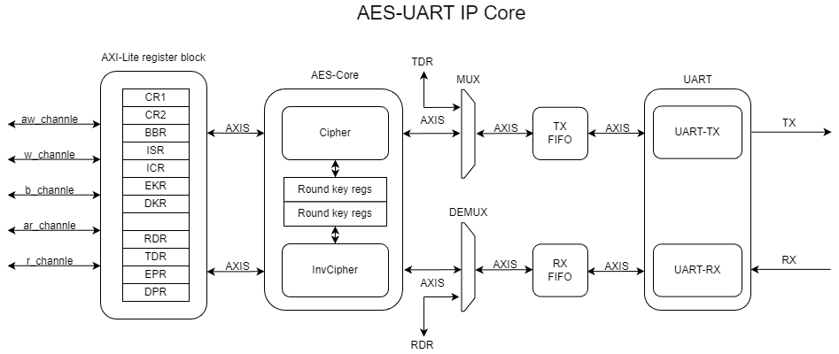

# AES-UART IP Core

这是一个基于 SystemVerilog 设计的增强型 UART IP 核，集成了硬件 AES-128/192/256 加密与解密引擎。该核心允许通过 UART 接口安全地传输数据，支持通过 AXI4-Lite 总线进行配置和数据访问。

## 目录
- [简介](#简介)
- [主要特性](#主要特性)
- [文件架构](#文件架构)
- [系统架构](#系统架构)
- [寄存器映射](#寄存器映射)
- [使用说明](#使用说明)
- [仿真与测试](#仿真与测试)

## 简介
AES_UART 模块将标准的通用异步收发传输器 (UART) 与 Advanced Encryption Standard (AES) 算法硬件加速器相结合。用户可以选择以标准 UART 模式发送明文，或者启用加密模式，将写入的数据自动加密后发送。同样，接收端可以选择直接读取原始数据或通过解密引擎还原数据。

## 主要特性
- **标准 UART 功能**：
  - 可编程波特率生成器 (分数分频)。
  - 支持数据位 (7/8/9)、停止位 (0.5/1/1.5/2)、奇偶校验 (无/奇/偶) 配置。
  - 是别错误检测：溢出错误 (ORE)、噪声错误 (NE)、帧错误 (FE)、奇偶校验错误 (PE)。
- **硬件 AES 引擎**：
  - 支持 AES-128, AES-192, AES-256 标准。
  - 独立的加密和解密路径。
  - 自动密钥扩展 (Key Expansion)。
  - 支持动态更新密钥。
- **接口**：
  - **AXI4-Lite Slave**：用于寄存器配置、状态读取及数据读写。
  - **UART (Rx/Tx)**：物理串行接口。
- **缓冲与流控**：
  - 发送和接收路径均配备 16-深度 FIFO。
  - 支持 TX/RX FIFO 阈值中断。

## 文件架构
```text
AES_UART/
├── AES_UART.sv            // 顶层文件，集成 UART, AES, FIFO 和寄存器接口
├── tb_AES_UART.sv         // 顶层测试平台
├── aescore/               // AES 加密/解密核心
│   ├── rtl/
│   │   ├── cipher/        // 加密器模块 (SubBytes, ShiftRows, MixColumns 等)
│   │   ├── invcipher/     // 解密器模块 (InvSubBytes, InvShiftRows 等)
│   │   └── common/        // 公共模块 (KeyExpander, SBox 等)
│   └── tb/                // AES 子模块测试平台
├── axilregs/              // AXI4-Lite 寄存器接口与控制逻辑
│   └── rtl/
│       ├── axil_regs.sv
│       └── axilregs_pkg.sv // 寄存器结构定义
├── fifo/                  // 同步 FIFO 模块
├── uart/                  // UART 收发核心逻辑
└── port/                  // 接口定义与 AXI Stream 辅助模块
```

## 系统架构
系统主要由以下四个部分组成：
1.  **AXIL_REGS**: 处理 AXI4-Lite 总线读写请求，管理控制寄存器 (CR)、状态寄存器 (ISR) 以及数据寄存器。它负责将 32 位寄存器数据打包/解包为 AES 所需的 128 位数据块。
2.  **AES Core**: 包含独立的加密 (Cipher) 和解密 (InvCipher) 路径。数据通过 AXI-Stream 接口流入，经过 AES 运算后流出。支持密钥长度动态配置。
3.  **UART Core**: 标准 UART 收发逻辑，负责物理层时序。
4.  **Data Path Muxing**:
    - **发送路径**: 根据 `CR1.EE` (Encryption Enable) 选择数据源。置位时，数据流经 `EPR -> AES Cipher -> FIFO -> UART TX`。复位时，数据流经 `TDR -> FIFO -> UART TX`。
    - **接收路径**: UART RX 数据存入 FIFO。根据 `CR1.DE` (Decryption Enable) 选择去向。置位时，数据流向 `InvAES Cipher -> DPR`。复位时，数据直接流向 `RDR`。

## 寄存器映射
基地址由系统互联分配，以下偏移地址基于基地址计算：

### 控制与状态寄存器
| 寄存器 | 偏移 | 描述 |
| :--- | :--- | :--- |
| **CR1** | `0x00` | 控制寄存器 1 (使能, 模式, 数据格式, 密钥长度) |
| **CR2** | `0x04` | 控制寄存器 2 (中断使能, FIFO 阈值配置) |
| **BRR** | `0x08` | 波特率寄存器 (整数与小数分频系数) |
| **ISR** | `0x0C` | 中断状态寄存器 (只读) |
| **ICR** | `0x10` | 中断清除寄存器 (写 1 清除) |

### 数据寄存器
| 寄存器 | 偏移 | 描述 |
| :--- | :--- | :--- |
| **RDR** | `0x14` | 接收数据寄存器 (直接 UART读取, 32位只用低8位) |
| **TDR** | `0x18` | 发送数据寄存器 (直接 UART写入, 32位只用低8位) |
| **EKR1-8**| `0x1C`-`0x38` | 加密密钥寄存器 (256-bit Key, 低位在前) |
| **DKR1-8**| `0x3C`-`0x58` | 解密密钥寄存器 (256-bit Key, 低位在前) |
| **EPR1-4**| `0x5C`-`0x68` | 加密明文输入寄存器 (128-bit Block, **写 EPR4 触发加密**) |
| **DPR1-4**| `0x6C`-`0x78` | 解密明文输出寄存器 (128-bit Block, **读 DPR4 释放数据**) |

### CR1 位域定义
- `[0] AUE`: 全局使能
- `[1] RE`: 接收使能
- `[2] TE`: 发送使能
- `[3] DE`: 解密使能 (Redirect RX FIFO to AES Decryptor)
- `[4] EE`: 加密使能 (Redirect AES Encryptor output to TX FIFO)
- `[14:13] EL`: 加密密钥长度 (00: 128b, 01: 192b, 10: 256b)

## 使用说明

### 1. 配置波特率与格式
写入 `BRR` 设置波特率分频系数，写入 `CR1` 配置数据位、停止位和校验位。最后置位 `CR1.AUE`, `CR1.TE`, `CR1.RE` 启动 UART。

### 2. 标准 UART 收发
- **发送**: 查询 `ISR.TXE` 为 1 后，写入数据到 `TDR`。
- **接收**: 查询 `ISR.RXNE` 为 1 后，从 `RDR` 读取数据。

### 3. 加密发送
1. 将密钥写入 `EKR1` ~ `EKR8` (根据选定长度)。
2. 配置 `CR1.EL` 并置位 `CR1.EE` (加密使能)。
3. 将 128-bit 明文分 4 次写入 `EPR1` ~ `EPR3`，最后写入 `EPR4`。
4. 写入 `EPR4` 后，数据自动进入加密引擎，完成后推入 TX FIFO 发送。
5. 等待 `ISR.ERE` 再次置位后可写入下一个块。

### 4. 解密接收
1. 将密钥写入 `DKR1` ~ `DKR8`。
2. 配置 `CR1.DL` 并置位 `CR1.DE` (解密使能)。
3. UART 接收并缓冲满 128-bit 数据后，自动送入解密引擎。
4. 当 `ISR.DRNE` 置位时，表示解密完成。
5. 依次读取 `DPR1` ~ `DPR3`，**最后读取 `DPR4`** 以释放缓冲区供下一个数据块使用。

## 仿真与测试
项目包含完整的 SystemVerilog Testbench。
- `tb_AES_UART.sv`: 顶层测试，模拟 CPU 接口操作寄存器，并回环测试 UART 数据的加密与解密正确性。
- 运行仿真前请确保仿真器支持 SystemVerilog。

---
*Created by AES_UART Project Team*
